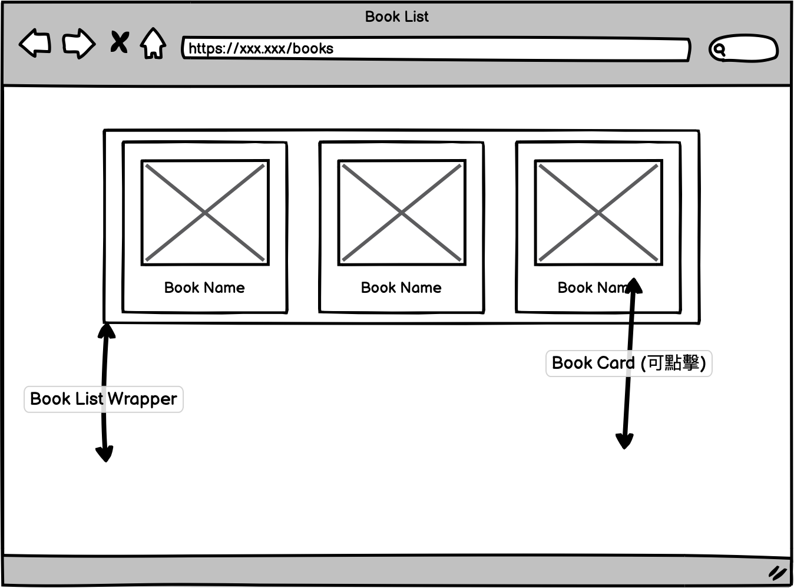
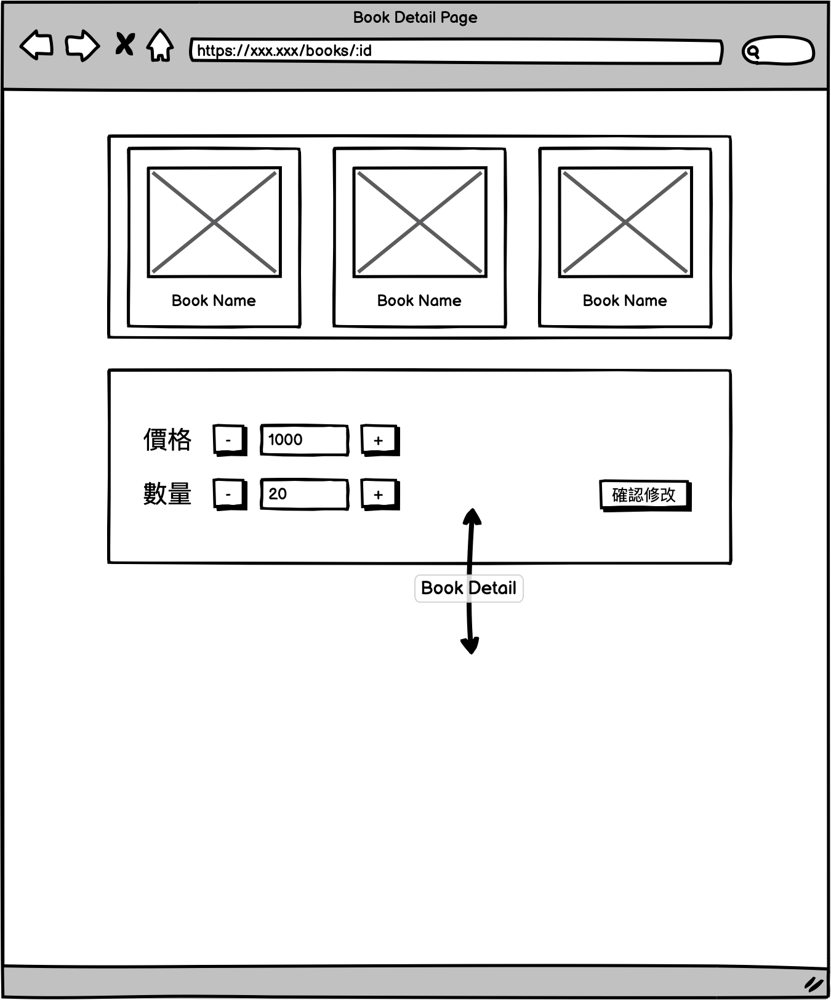

# 創順科技 Frontend Engineer 徵才小專案

這是一個小型的徵才專案，會需要你使用 Vue 和 API 所提供的資料，依照 wireframe 來完成頁面。

## 說明

- 請參考 **wireframe** 及 **頁面需求** 實作此專案
- 請使用 Vue 進行開發
- 使用 git / GitHub 來做整個專案的版本控管
- 請將小專案上傳到 GitHub， **不接受其它方式或信件夾帶壓縮檔的形式繳交作業**
- 提供一份 README 文件說明：
  - 我們該如何執行你完成的專案
  - 專案的架構、邏輯說明
  - 你對於所有使用到的第三方 library 的理解，以及為何使用它
  - 在這份專案中你遇到的困難、問題，以及解決的方法

## 加分建議

- 程式的可讀性與可維護性
- 使用 vue 3 或是 composition-api
- 使用 tailwind css
- 任何你覺得可以讓網頁變得更有趣或是很酷的事情

## 頁面需求

- 整個專案會需要兩個頁面
  - Book List Page (網址: `/books`)
  - Book Detail Page (網址: `/books/:bookId`)
- "Book List Page"、"Book Detail Page" 都有一個 "Book List" 在頁面上水平置中 (API: `GET https://fe-interview-api.unnotech.com/books`)
- "Book List" 上的元素我們稱為 "Book Card"，在 "Book List" 中由左到右排列，一般尺寸螢幕可以左右滾動，但如果在小尺寸螢幕上列表中的元素超出畫面就自動往下排列
- "Book Card" 必須包含圖片和名字，且是可以點擊的連結
- "Book Card" 連結會連到單一 Book 的 "Book Detail Page"，"Book List" 依然在相同位置，並且不因切換連結重新 render
- 當在 "Book Detail Page" 時要將現在所選中的 "Book Card" 用不同的顏色或圖案標示出來
- "Book Detail Page" 中，在 "Book List" 底下會有一個 "Book Detail"
- "Book Detail" 會顯示 Book 的價格與庫存數量 (API: `GET https://fe-interview-api.unnotech.com/profile/:bookId`)，並且在數值左右各有一個按鈕，負責做增減功能，不能小於零。
- "Book Detail" 右下方有一個修改按鈕，按下按鈕後，會將現在設定的數值提交更新 server 上的資料 (API: `PATCH https://fe-interview-api.unnotech.com/profile/:bookId`)。

## Wireframe





## 最後

當你完成後，請將你的 GitHub repo 連結 e-mail 給我們。

如果過程中你有任何問題，不論是看不懂我們所寫的文件，或是對於我們提供的 API 有疑問，都歡迎直接 e-mail 和我們討論。

## 我們所提供的 API

### List Books [GET] `https://fe-interview-api.unnotech.com/books`

**Request**

```bash
curl -H "Accept: application/json" -H "Content-Type: application/json" -X GET https://fe-interview-api.unnotech.com/books
```

**Response 200**

```js
[
  {
    id: 1,
    name: "Flutter/Dart 跨平台 App 開發實務入門",
    image: "https://cf-assets2.tenlong.com.tw/products/images/000/157/608/medium/ACL060200.jpg?1613558091"
  },
  // ...
]
```

### Single Book [GET] `https://fe-interview-api.unnotech.com/books/:bookId`

**Request**

```bash
curl -H "Accept: application/json" -H "Content-Type: application/json" -X GET https://fe-interview-api.unnotech.com/books/1
```

**Response 200**

```js
{
  id: 1,
  name: "Flutter/Dart 跨平台 App 開發實務入門",
  image: "https://cf-assets2.tenlong.com.tw/products/images/000/157/608/medium/ACL060200.jpg?1613558091"
}
```

### Book Detail [GET] `https://fe-interview-api.unnotech.com/profile/:bookId`

**Request**

```bash
curl -H "Accept: application/json" -H "Content-Type: application/json" -X GET https://fe-interview-api.unnotech.com/profile/1
```

**Response 200**

```js
{
  id: 1,
  price: 200,
  count: 20
}
```

### Patch Book Detail [GET] `https://fe-interview-api.unnotech.com/profile/:bookId`

**Request**

```bash
curl -X PATCH -H "Content-Type: application/json" -d '{"price": 300}' "https://fe-interview-api.unnotech.com/profile/1"
```

**Response 200**

```js
{
  id: 1,
  price: 300,
  count: 20
}
```
